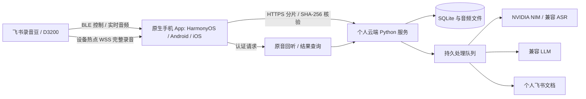

# 架构与代码位置

## 手机源码与构建来源

- `harmony/shared/`：纯 TypeScript 协议、分片、哈希、同步、状态表示；可在 Node 下测试。
- `harmony/entry/src/main/ets/`：共用原生端能力，部分共享 TypeScript 在此有构建副本。
- `harmony/standard-overlay/`：当前普通 App 的页面、设备客户端、安全存储、高速传输、原生服务覆盖。
- `harmony/resources/`：普通 App 资源；`project/` 是 DevEco 工程骨架和历史元服务代码，不能跳过覆盖步骤直接将骨架当成当前 App。
- `prepare_harmony_variant.py`：以本机空白工程作基础，先共用源码、后普通 App 覆盖、再资源；不复制签名。
- `android/`：Android BLE、临时热点、完整录音与实时窗口、云端客户端及界面。
- `ios/`：SwiftUI、CoreBluetooth、手动／自动热点路径；`ios/Sources/RecordingBeanCore/` 放共享协议和云端客户端。

修改普通 App 优先以 standard-overlay 同名文件为准；协议控制器修改 shared 后同步 entry 构建副本，测试与真机编译同时验证。设备扫描地址只负责连接；归档设备 ID 来自有效序列号摘要，不将原始序列号上传或写入日志。

## 服务端

`bean/server.py` 提供 HTTP 与认证，`core.py` 管理 SQLite/上传与完整性，`live.py` 管理实时会话，`pipeline.py`/worker 串行推进转写、说话人字段处理、总结与飞书写入。provider 设置保存在权限受限的私有文件，通过接口只返回已配置标志，不返回真实密钥。完整清单以源码为准。

上传确认之前不能清理手机完整文件；任务完成、识别能力和文字准确性是不同概念。转写缺口保留，匿名说话人编号不跨分片直接合并。飞书发布使用固定记录映射及回读，重试避免重复创建文档。

## 信任边界

部署为单人服务：持有服务访问口令的人可管理该部署和供应商设置；不存在公共多租户隔离。公网只通过 HTTPS 反向代理接入，应用后端绑定回环地址。受保护音频使用认证头/会话访问，飞书中的链接不是永久公开音频链接。

设备热点使用限定地址、限定证书指纹的兼容实现；设备过期/IP 不匹配证书的特殊处理不扩展到公网 HTTPS。换设备或固件需重新核对证书，不能直接关掉所有校验。

数据库与音频/供应商结果在服务器本地持久化；独立备份和凭据安全保管是另外的恢复边界，GitHub 源码无法代替它们。
